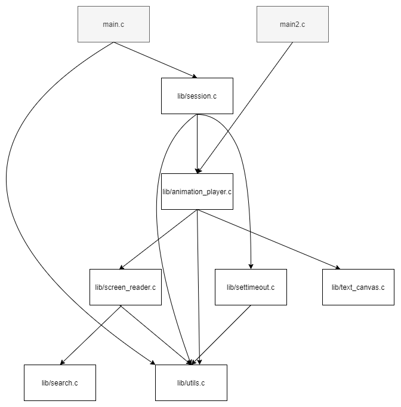
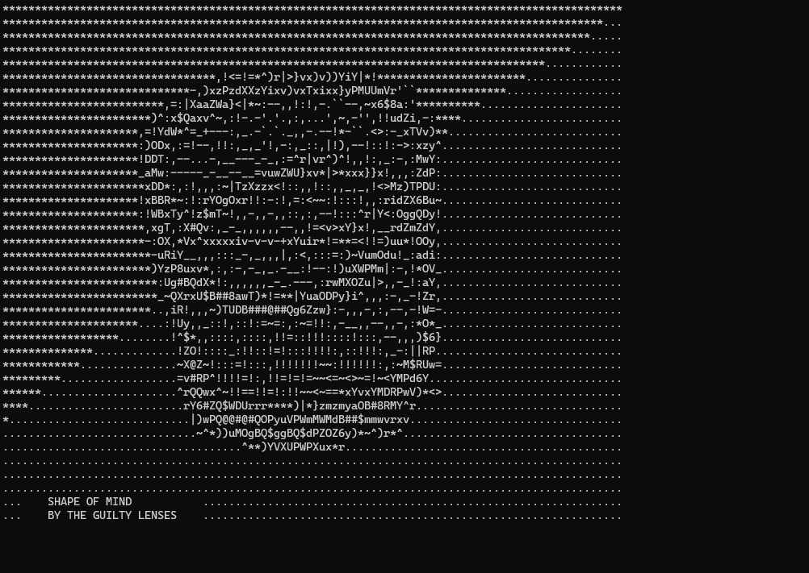

## Shape of Mind
- [Introduction](#introduction)
- [Motivation](#motivation)
- [Module Dependencies](#module-dependencies)
- [GIF Example](#gif-example)
- [How To TELNET](#how-to-telnet)
- [Building Locally](#building-locally)
- [TODO](#todo)

### Introduction
An ascii lyric animation.

Program plays the lyrics(ascii animation) of the song [Shape of Mind](https://www.youtube.com/watch?v=bVukbkZG9ik&t=881s) by The Guilty Lenses.
There are two entries to the program.
- `main.c` TCP server that streams the ascii animation so that the telnet client can then connect and play on the terminal
- `main2.c` plays the ascii animation promptly on the terminal

### Motivation
Few things happened around begining of December:
- Found out that my cousin had put out an amazing album. His debut release.
- Had been playing with telnet, and came across this impressive telnet server that streamed Star Trek in ascii.
- Played Thimbleweed Park; the story was clever and for the visuals it had beautiful pixel art.

Thus, it was decided: An ascii lyric video, which could be played by connecting telnet client.

### Module Dependencies

### GIF Example

### How To TELNET
Host `35.232.192.197` port `4000`. Considering you have a telnet client, try `telnet 35.232.192.197 4000` on the terminal. 
Terminal size: 100 rows and 38 columns.

### Building Locally
Currently, source may be compiled on POSIX compliant UNIX and UNIX like OS. There aren't no external dependency except for the CRT.
Development was done in gcc (Ubuntu 7.5.0-3ubuntu1~18.04) compiler with x86_64-linux-gnu as target.

Set executable permission to `build.sh` shell script, then run it. Then:
- Run `./build/main` from the root of the project to run telnet server
- Run `./build/main2` from the root of the project to promptly play the animation on terminal

### TODO
- Not a complete telnet implementation. For e.g. ignores option negotiation.
- Have a platform layer so that the source be easily compiled across different platforms.
- Not happy with interface of `lib/session.c` module.
- Optimistic about network delays and other things for now, and might impact timing of lyric.
